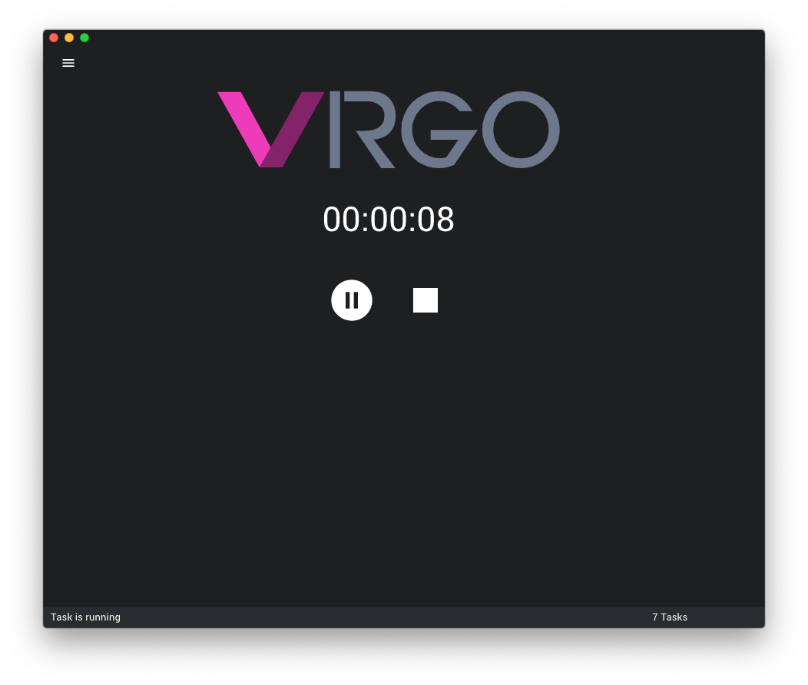

<!-- @format -->

<p align="center">
    <br/>
    Crowdsourced fuzzing cluster. 🚀
<p>

<p align="center">
     <a href="https://travis-ci.org/mozillasecurity/virgo"></a> <a href="https://github.com/MozillaSecurity/virgo/releases"></a> <a href="https://david-dm.org/mozillasecurity/virgo"></a> <a href="https://codecov.io/gh/MozillaSecurity/virgo"></a>
</p>

## Overview

- [What is Virgo?](#What-Is-Virgo?)
- [How does it work?](#How-Does-It-Work?)
- [Usage](#Usage)
- [Issues](#Issues)
- [Contributing](#Contributing)
- [Screenshots](#Screenshots)

## 🤔What is Virgo?

[Virgo](https://en.wikipedia.org/wiki/Virgo_Supercluster) is a concept for creating a cluster of fuzzers made by users who are willing to trade and contribute their CPU resources of their workstations to a greater good.

**Use Cases**

- Intracompany fuzz testing by using office workstations after-hours without additional spending on cloud providers.
- Software developers can point Virgo to their own Task Definition Server and quickly test among colleagues newly developed features.
- Bug bounty hunters and open source supporters creating a collective supercluster in testing features more quickly and more intensively, and potentially get rewarded for providing their CPU time.

Virgo can theoretically be used for any arbitrary work task defined in a container. However, Virgo was built as a fuzzing solution in mind.

## 💡How does it work?

Virgo's infrastructure is based on Docker. Virgo fetches routinely a remote server for new tasks by downloading a [Task Definition File](https://virgo-tasks.herokuapp.com/tasks) which contains information on how to run a task and which host preferences are required.
If the required hosts preferences meet the constraints for a certain task, Virgo will download the image, create a container and run that container until a user action intervenes or run "indefinitely". An intervention can be pause, stop, a scheduler, observed system or network activity. If a crash is found during a run, it immediately is sent to our backend for further analyzation and in case of a security issue, you will be informed by the provided contact email address.

## 🚀Usage

Virgo is in its beta stage, obscure bugs may occur. We urge you to file these in our GitHub [issue tracker](https://github.com/MozillaSecurity/virgo/issues) along with any suggestions or feature requests you might have.

You need to have the Docker engine installed and running on your computer. If you do not have it installed, here are some quick steps to get ready quickly.

### Preparation

#### MacOS

```
brew cask install docker
```

Alternatively: https://download.docker.com/mac/stable/Docker.dmg

#### Windows

```
choco install docker-desktop
```

Alternatively: https://download.docker.com/win/stable/Docker%20for%20Windows%20Installer.exe

#### Linux

```
./scripts/install_docker.sh
```

> Do not forget to log out/in after this step.

To make sure Docker is setup and running, you can run the following command: `docker run hello-world`. If you see the `"Hello from Docker!"` message after some seconds, you are good to go.

### Launch

You can now launch Virgo which you downloaded for your platform from the release page.

> Note: If you are on Linux run `chmod a+x virgo*.AppImage` before you try to launch it.

If you want to get notified about found security issues discovered by your machine, provide your email address in the Preferences. This step is optional but if your workstation has found a security related issue we will add you to the Bugzilla report to get notified.

## Issues

In case of abnormal behaviour of the application you can reset Virgo to factory default settings.

### Common

#### MacOS

```
rm ~/Library/Application\ Support/virgo/config.json
```

#### Windows

```
rm C:\Users\%USERNAME%\AppData\Local\virgo\config.json
```

#### Linux

```
rm ~/.config/virgo
```

If a task was still running before you closed Virgo, then you can find the task in the `Activity` tab, where you can manually stop and delete it.

### Debugging

If you want to take a glimpse in what is happening under the hood, go to the `Activity` tab and copy the container id of the running task. You can then in the Terminal run: `docker logs <id> --follow` to see what is happening.

## Contributing

### Launch Virgo

```
git clone https://github.com/mozillasecurity/virgo && cd virgo && npm -s install
npm start
```

> Developer extensions are enabled in non-production builds, except Devtron for analyzing IPC traffic. You can enable it by entering `require('devtron').install()` in the Developer Console.

To produce a production build run first `npm run build` and optionally `npm run release <platform>`. Where `platform` can be `macos64`, `windows64`, `linux64` or `''` to create a release for all platforms.

For a detailed list of commands run `npm run`

### Launch Task Definition Server

```
cd heroku && npm -s install && npm start
```

> You will need to point Virgo to your custom Task Definition Server in the Preferences.

See [Wiki](https://github.com/MozillaSecurity/virgo/wiki) for detailed setup instructions including Minio for testing in-app updates, Sentry.io for in-app crashes and FuzzManager as custom crash collector backend.

## Screenshots




## Author

👤 **Christoph Diehl &lt;cdiehl@mozilla.com&gt;**

- Twitter: [@posidron](https://twitter.com/posidron)
- Github: [@posidron](https://github.com/posidron)
