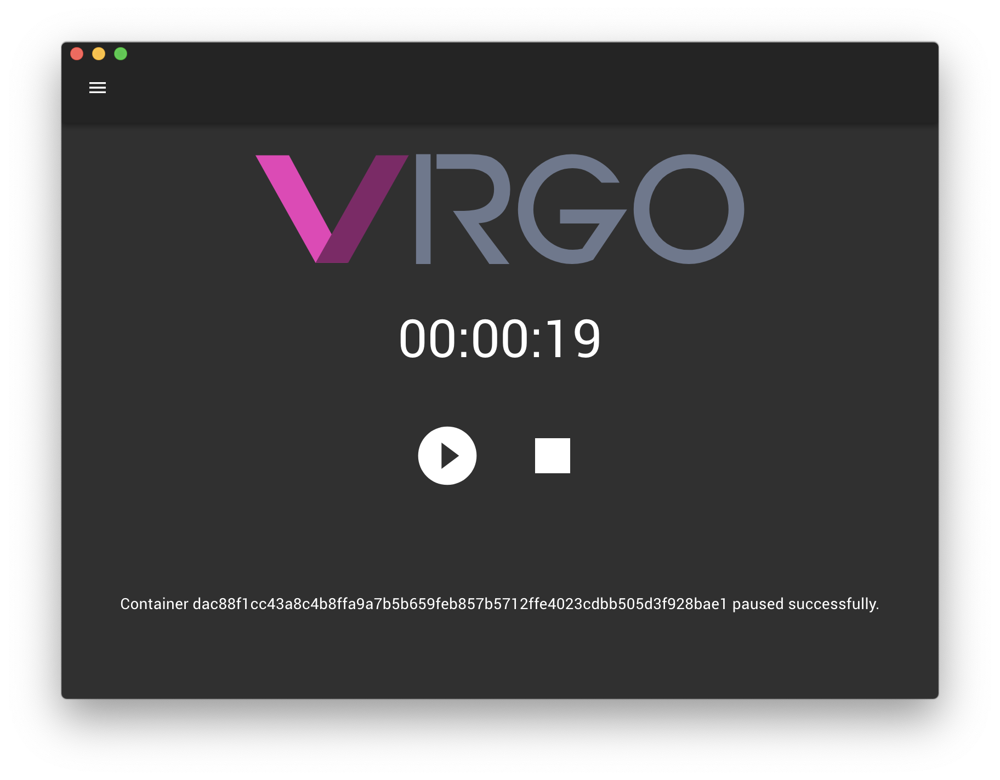
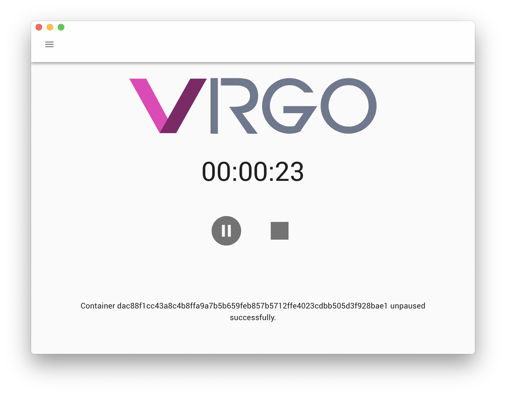

<!-- @format -->

<p align="center">
    <br/>
    🚧 A crowdfuzz solution for everyone. 🚧
<p>

<p align="center">
    <a href="https://github.com/prettier/prettier"></a> <a href="https://travis-ci.org/mozillasecurity/virgo"></a> <a href="https://img.shields.io/github/release/mozillasecurity/virgo.svg"></a> <a href="https://david-dm.org/mozillasecurity/virgo"></a> <a href="https://coveralls.io/github/MozillaSecurity/virgo?branch=master"></a> <a href="https://www.irccloud.com/invite?channel=%23fuzzing&amp;hostname=irc.mozilla.org&amp;port=6697&amp;ssl=1"></a>
</p>

## Overview

- [Virgo]()
  - [What is Virgo?](#What-Is-Virgo?)
  - [How does it work?](#How-Does-It-Work?)
  - [Why should I participate?](#Why-Should-I-Participate?)
- [Developer Usage](#Developer-Usage)
  - [Commands](#Commands)
- [Screenshots](#Screenshots)

## What is Virgo?

Virgo aims to be a concept for creating a cluster of fuzzers made by people who are willing to trade and contribute IDLE times of their workstations to a greater good.

## How does it work?

Virgo's infrastructure is based on Docker containers. Virgo fetches routinely a remote server for new tasks by downloading a `Task Definition File`. This file contains information in how to run a certain Docker image and what host preferences are required. If the hosts preferences met the criterias for a certain task, Virgo will download the Docker image, create a container and run that container until the user either pauses or stops that task manually or by having a sheduler setup to automate this routine.

## Why should I participate?

Virgo can theoretically be used for any arbitrary work task defined in a container. However, Virgo was built as a fuzzing solution in mind. The more people participate, the faster and more intesively we can test a particular feature in our products. Besides that, you can earn a bounty once your task discovered a security issue. If multiple users found the same issue, the bounty will be shared across the pool of finders.

## Developer Usage

The project recommends `yarn`. If you have not installed `yarn` follow the individual platform instructions [here](https://yarnpkg.com/en/docs/install). For MacOS it is as easy as running `brew install yarn`.

```
git clone --depth=1 https://github.com/mozillasecurity/virgo <project-name>
cd <project-name>
yarn install
```

You have now successfully checked-out Virgo. To run the development version use `yarn start` and to produce a production build run `yarn dist`.

## Commands

For a detailed list of commands take a look into the `scripts` section of `package.json`.

## Screenshots



